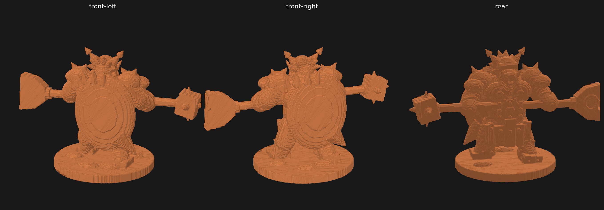

# Massive Darkness: Troglodytes — Bloodseeker Minotaur proxy

Оригинальная стилизованная 3D-интерпретация кровожадного минотавра по
предоставленному фото и дополнительным ракурсам. Это не скан и не точная копия
официальной миниатюры CMON.

## Файлы

| Файл | Назначение |
| --- | --- |
| `bloodseeker-minotaur/bloodseeker-minotaur-proxy.stl` | Цельная сетка для 3D-печати |
| `bloodseeker-minotaur/bloodseeker-minotaur-proxy.glb` | Компактная модель для просмотра и импорта |
| `previews/bloodseeker-minotaur-preview.png` | Вид спереди слева, спереди справа и сзади |
| `scripts/generate_bloodseeker_minotaur_proxy.py` | Воспроизводимый процедурный генератор |



## Параметры модели

- габариты: `107,9 × 54,9 × 64,0 мм`;
- диаметр подставки: около `48 мм`;
- сетка: `176 158` треугольников;
- один замкнутый компонент без открытых рёбер;
- основные элементы силуэта: рогатая голова, звериные наплечники, сегментированный
  нагрудник, плащ, широкая секира и шипованный противовес.

## Печать

Для сохранения мелких деталей рекомендуется фотополимерная печать:

1. Наклонить модель назад на `20–30°`.
2. Поставить средние опоры под древко, лезвие секиры, противовес, локти и края плаща.
3. Использовать слой `0,03–0,05 мм`.
4. Проверить габарит `108 мм` по ширине относительно области печати.

## Повторная генерация

```bash
python3 -m pip install -r model-kits/massive-darkness-troglodytes/requirements.txt
python3 model-kits/massive-darkness-troglodytes/scripts/generate_bloodseeker_minotaur_proxy.py
```

## Референсы

- фото из запроса;
- [официальная страница Massive Darkness: Troglodytes](https://www.cmon.com/products/troglodytes/);
- [фото мастер-модели и дополнительные ракурсы](https://monster-zer0.blogspot.com/2016/06/massive-darkness-bloodseeker-minotaur.html).
